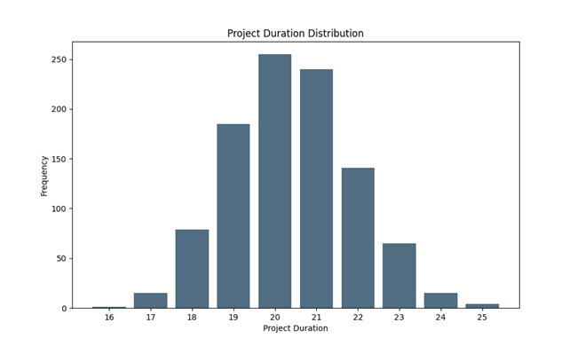
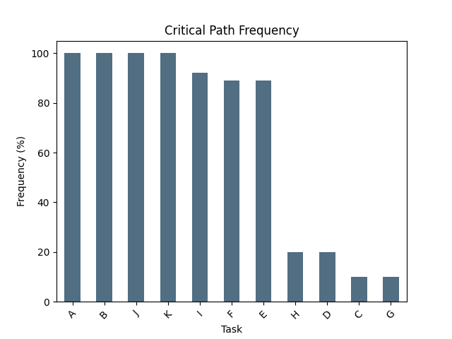

# Probabilistic Risk Assessment (PRA) Simulator for Project Management

This project, developed as part of the Strategic Programs course at the University of Genoa by Sepehr Mohammady, implements a Probabilistic Risk Assessment (PRA) for project schedules. It uses Monte Carlo simulation to model uncertainties in activity durations and analyze their impact on the overall project duration and critical path.

## Introduction

The Probabilistic Risk Assessment (PRA) script incorporates potential risks and their impact on activity durations. It calculates risk-adjusted durations for each activity and recalculates the Critical Path Method (CPM) with these adjusted durations. The script identifies the risk-adjusted critical path and provides visual representations and statistical analysis of potential project outcomes.

## Key Features

*   **Custom Duration Functions:** Allows for realistic and varied duration modeling based on different probability distributions and custom logic for specific activities.
*   **Monte Carlo Simulation:** Runs multiple simulations (e.g., 1000 iterations) to account for variability in activity durations.
*   **Critical Path and Drag Calculation:** Identifies the critical path and calculates drag for activities within each simulation.
*   **Output and Analysis:** Provides detailed output and analysis, including:
    *   Project duration distribution (e.g., mean and 95th percentile).
    *   Critical path frequency (how often each activity appears on the critical path across simulations).
    *   Activity analysis based on mean durations.

## Core Concepts & Approach

1.  **Custom Duration Functions:**
    *   For some tasks, durations are not simple estimates but depend on various factors. This script allows defining custom Python functions (e.g., `durA()`, `durB()`, `durC()`, `durD()` as in the example code) to model these complex uncertainties or specific risk events.
    *   Other tasks use a normal distribution (`dur_normal(mean, std_dev)`) to model variability.
2.  **Simulation:**
    *   The script runs a specified number of iterations (e.g., 1000).
    *   In each iteration:
        *   Activity durations are sampled based on their defined distributions or custom functions.
        *   A full CPM analysis (forward pass, backward pass, critical path identification) is performed.
3.  **Project Duration Distribution:**
    *   The overall project durations from all simulations are collected.
    *   Statistical measures like the mean project duration and the 95th percentile project duration are calculated, providing insights into the likely range of project completion times.
4.  **Critical Path Frequency:**
    *   Tracks how often each activity appears on the critical path across all simulations. This helps identify activities that are consistently critical versus those that are only critical under certain risk scenarios.

## Technologies Used

*   Python 3.x
*   NumPy (for numerical operations and random number generation)
*   Pandas (for data manipulation and analysis, e.g., critical path frequency)
*   Matplotlib (for plotting histograms and bar charts)

## Setup and Installation

1.  Clone the repository:
    ```bash
    git clone https://github.com/SepehrMohammady/PRASimulator.git
    cd PRASimulator
    ```
2.  (Recommended) Create and activate a virtual environment:
    ```bash
    python -m venv pra
    source pra/bin/activate  # On Windows use `pra_env\Scripts\activate`
    ```
3.  Install dependencies:
    ```bash
    pip install -r requirements.txt
    ```

## How to Run

Execute the Python script from the terminal:
```bash
python PRA.py
```
The script will print statistical analysis to the console and display the output charts.

## Sample Input Data Structure (within the script)

The script defines activities with mean durations and standard deviations (for normal distributions), and dependencies:
Example structure (refer to the script for actual values)
activities = {
    'A': (2, 0),    # (mean_duration, std_dev)
    'B': (1, 0.2),
    'C': (3, 0.7),
    # ... and so on
}

dependencies = {
    'A': [],
    'B': ['A'],
    # ... and so on
}

Custom duration functions like durA(), durB() are also defined in the script to model specific risk scenarios for certain tasks.

## Example Output

(Note: Results may vary slightly due to the random nature of the simulation.)

**Console Output (Example):**
Mean project duration: 20.405
95th percentile project duration: 23.0

Critical Path Frequency:
Task  Freq
A      100
B      100
J      100
K      100
I       92
F       89
E       89
... (other tasks with their frequencies)

Activity Analysis (at mean duration):
Activity    ES  EF  LS  LF  Float   Drag    Critical
A           ... ... ... ... ...     ...     ...
B           ... ... ... ... ...     ...     ...
... (full table as generated by your script)

Charts:
Project Duration Distribution:



Critical Path Frequency:



## License

This project is licensed under the MIT License - see the [LICENSE](LICENSE) file for details.
